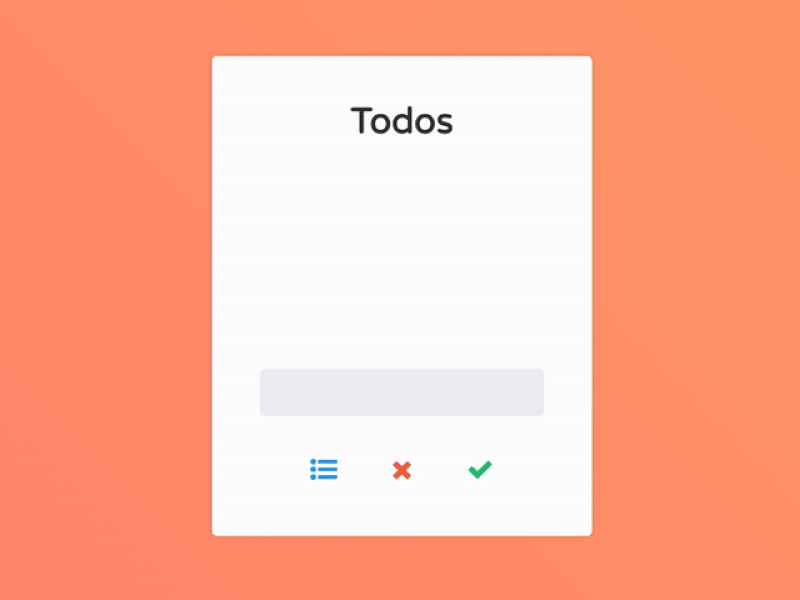

# Todo Assignment

### Assignment: Todo Application

You are building the **Todo application** with the technology uses **React.js, Node.js & MongoDB**.

1. New todo can be added and removed just like as attached gif.
2. Completion and removal of todo should be on gestures (click and swipe).
3. REST conventions should be used for the API endpoints.
3. Make it simple and animated.

For the reference, see the attached image. 
 

